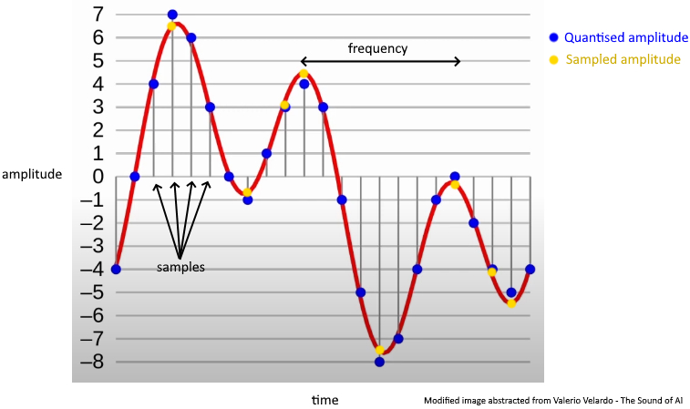
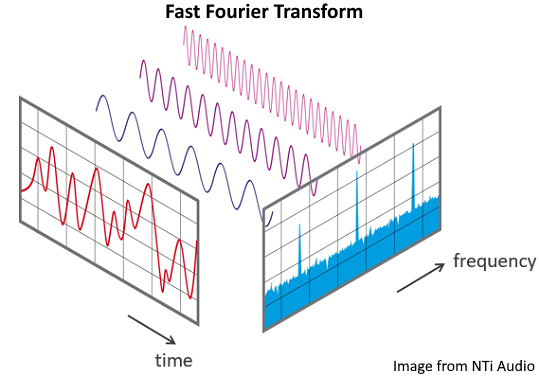
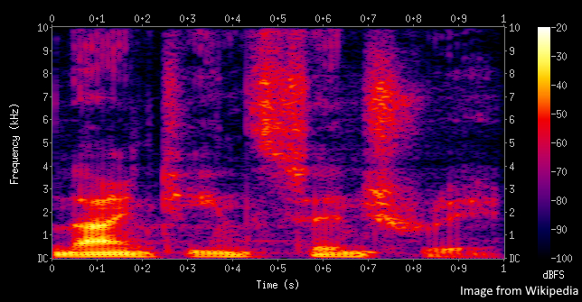
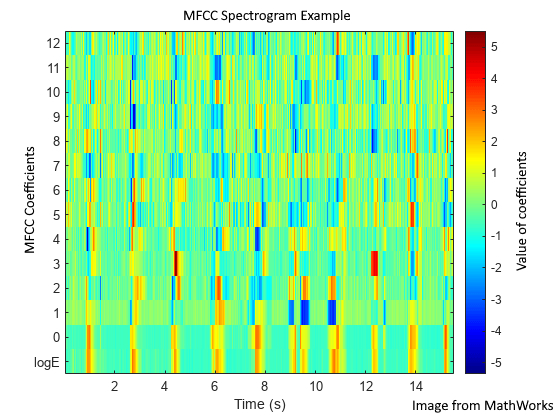

# Music Genre Classification using a CNN
## Table of Contents

  * [🗺️ Overview](#%EF%B8%8F-overview)
  * [📝 Theory behind processing audio data](#%EF%B8%8F-overview)
  * [⚙️ Pre-processing steps and Data preparation](#%EF%B8%8F-preprocessing-steps-and-data-preparation)
  * [📦 Model](#-model)
  * [⏳ Training](#-training)
  * [📊 Results and Analysis](#-results-and-analysis)
  * [🙏 Acknowledgements](#-acknowledgements)
  

## 🗺️ Overview

I'm interested in working with audio data for machine learning as I've never done so before, so I'm eager to explore the concepts required to build a deep learning model that aims to solve an audio related task. The GTZAN dataset is a collection of music consisting of 10 genres with 100 audio (.wav) files each, all having a length of 30 seconds. The task of this project is: given a sample of the audio file, determine its music genre. Segments of audio files be taken, and MFCC's (Mel-frequency cepstral coefficients) will be extracted. Each MFCC is labelled with its respective genre, and these will form as training samples to be passed to a Convolutional Neural Network which is trained for a multi-class classification task. Essentially, I'm creating an end-to-end model for this task.

## 📝 Theory behind processing audio data

### Analog Digital Conversion
Sound can be represented by an **analog waveform**, in its simplest form it could be a sine wave. The wave is projected in the **Time** domain, so Time is on the y axis and we care about **amplitude** (the loudness) which is recorded on the x-axis. We can intrepret the **frequency** from this waveform as **pitch** This needs to be converted into a **digital signal** so that the waveform can be computed more efficiently - which motivates the need for **Analog Digital Conversion** as the first pre-processing concept. This is achieved through **sampling**, which is essentially reading the waveform at fixed intervals, defined by the **sampling rate** measured in Hz. Samples are indicated by the lines shown in the image below.

There are a fixed number of bits that we can use to store the amplitude, we can't store the exact value of the amplitude at each sample of the waveform so we need to 'round' it to the closest value bounded by the number of bits that we have. This process is called **quantization** and it's clear that the process of sampling and quantization combined will introduce a **small amount of error or noise**.

### Fourier Transform
However, most audio files in reality are not as simple as sine waves - they are much more complex. The good thing is that we can still model these complex waveforms through what is known as a **Fourier Transform**. This is the process of decomposing the complex periodic sound into a sum of wine waves oscillating at different frequencies. An FFT (Fast Fourier Transform) is an algorithm that we can use to perform this transformation. Since we care about producing a complex period sound from a combination of sine waves at different frequencies, it means that we must translate from the Time Domain to Frequency Domain and thus we lose the sense of time in the Fourier Transform.

### Short Time Fourier Transform (STFT)
The solution to the problem of losing time information is to compute several Fourier Transforms at multiple intervals, which in this case is known as **frames** and is defined by a fixed **frame size** (e.g. 2048 samples). All of this is achieved through a Short Time Fourier Transform (STFT), and the result of performing these series of steps is a **spectrogram** that gives information about time, amplitude and frequency all together.

### Mel-frequency Cepstral Coefficients
So far the actual features of the sound we are observing are the amplitude and frequency, but this only gives us information about the loudness of the sound and pitch of the sound respectively. The **tone quality (timbre) of the sound is important** as it allows us to identify what instrument is being played in the audio file. MFCC's are capable of storing this information and works within the **Frequency Domain**. The result of computing MFCC's are a set of coefficients stored as an MFCC vector. We capture information about time in a similar way to the STFT by extracting MFCC's at fixed intervals - again these are frames defined by frame sizes. The beauty of MFCCs is that the frequncy bands are equalled spaced on the mel scale (a perceptual scale of pitches judged by listeners to be equal in distance from one another), which provides an approximation of the human auditory system's response - providing us a better understanding of the representation of the audio files. Therefore, I will be using MFCCs as the representation of the audio data in this task. Note that MFCCs aren't just good for music genre classification - they are used a lot in audio-based deep learning tasks like Speech Recognition.

## ⚙️ Pre-processing steps and Data preparation

## 📦 Model

## ⏳ Training

## 📊 Results and Analysis

## 🙏 Acknowledgements

I'd like to thank Valerio Velardo for making his [Deep Learning for Audio with Python](https://github.com/musikalkemist/DeepLearningForAudioWithPython) resources available on GitHub and his fantastic in-depth tutorials on the topic.

